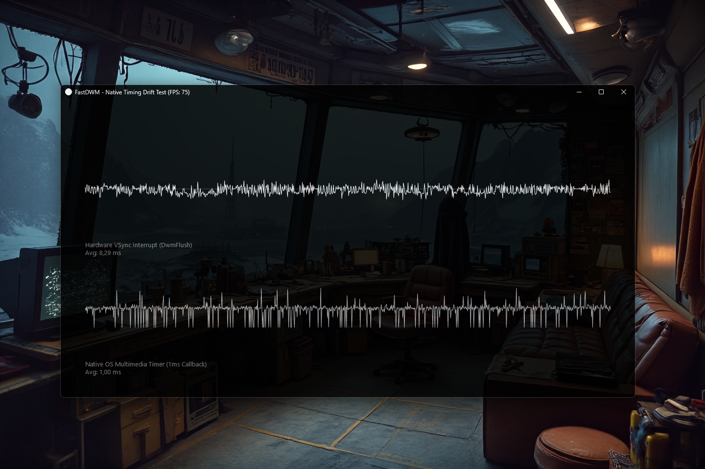

# FastDWM 0.1.0 [ALPHA] — Native Windows Timing & Composition

[](https://github.com/andrestubbe/FastDWM/releases/tag/0.1.0)
[](https://opensource.org/licenses/MIT)
[](https://www.java.com)
[]()
[](https://jitpack.io/#andrestubbe/FastDWM)

---

**⚡ Low-latency access to the Windows Desktop Window Manager (DWM). High-precision multimedia timers and VSync synchronization for the FastJava ecosystem.**

**FastDWM** is the low-level Windows composition and timing substrate of the **FastJava** ecosystem. It provides direct JNI access to `DwmFlush()`, allowing render loops to perfectly lock onto the physical monitor refresh rate (VSync) with zero allocations. Additionally, it offers direct access to the Windows Multimedia Timer API (`timeBeginPeriod` / `timeSetEvent`) to request true 1ms scheduling precision from the Windows Kernel, bypassing Java's notoriously inaccurate `Thread.sleep()`.

It is the foundation that powers **[FastAnimation](https://github.com/andrestubbe/FastAnimation)**, **[FastExecution](https://github.com/andrestubbe/FastExecution)**, and **[FastTween](https://github.com/andrestubbe/FastTween)** for zero-jitter native heartbeats and hardware-locked timelines.

[**Watch Demo (YouTube)**](https://youtu.be/iIx3bY8E8h0) | Watch JMH Benchmark (Youtube)

[](https://youtu.be/iIx3bY8E8h0)

---

## Quick Start

```java
import fastdwm.FastDWM;

public class Example {
    public static void main(String[] args) {
        // 1. Hardware-synced render loop locked to physical monitor VSync (0% tearing)
        Thread renderThread = new Thread(() -> {
            while (true) {
                FastDWM.waitForVSync(); // Blocks thread until the next physical DWM VSync pulse
                renderFrame();
            }
        });
        renderThread.start();

        // 2. Sub-millisecond periodic native timer (1ms multimedia timer callback)
        int timerId = FastDWM.createPeriodicTimer(1, () -> {
            processHighPrecisionAudioOrPhysics();
        });

        // 3. Stop native timer when finished
        // FastDWM.killTimer(timerId);
    }

    private static void renderFrame() {
        // Render tick with zero jitter
    }

    private static void processHighPrecisionAudioOrPhysics() {
        // 1ms native tick
    }
}
```

---

## Table of Contents

- [Why FastDWM?](#why-fastdwm)
- [Quick Start](#quick-start)
- [Key Features](#key-features)
- [Architecture](#architecture)
- [Real-World Examples](#real-world-examples)
- [Performance Benchmarks](#performance-benchmarks)
- [API Quick Reference](#api-quick-reference)
- [Technical Examples & Hero Demos](#technical-examples--hero-demos)
- [Installation](#installation)
- [Documentation](#documentation)
- [Platform Support](#platform-support)
- [License](#license)
- [Related Projects](#related-projects)
- [License](#license)

---

## Why FastDWM?

Java's standard UI loops (Swing/AWT/JavaFX) and game loops are completely disconnected from the underlying OS compositor (Desktop Window Manager). Standard `Thread.sleep()` in Windows defaults to an inaccurate ~15.6ms timer resolution, leading to tearing, micro-stutters, frame drops, and erratic animation velocities.

**FastDWM** breaks Java out of its sandbox:
1. **Physical VSync Synchronization**: Direct JNI access to `DwmFlush()` allows your render loops to perfectly lock onto the physical monitor refresh rate (60 Hz, 120 Hz, 144 Hz, 240 Hz) with zero CPU burn and zero heap allocations.
2. **1ms Kernel Timer Resolution**: Direct access to `timeBeginPeriod(1)` and `timeSetEvent` requests sub-millisecond timer granularity directly from the Windows Kernel scheduler, completely eliminating timer jitter.

---

## Key Features

- **⚡ Hardware-Locked VSync (`waitForVSync`)** — Synchronizes render ticks directly to the physical GPU vertical blank via native `DwmFlush()`.
- **⏱️ 1ms Kernel Multimedia Timers** — Reconfigures Windows interrupt dispatching from ~15.6ms down to true 1ms precision.
- **🔄 High-Precision Periodic Timers** — Asynchronous native callback timers via `timeSetEvent` bypassing JVM thread parking.
- **🗑️ Zero-Allocation Execution** — Pure direct JNI binding with 0 bytes allocated per frame.
- **🎨 FastJava Foundation** — Core timing substrate powering `FastAnimation`, `FastExecution`, and `FastTween`.

---

## Architecture

| Component | Layer | Technology | Key Responsibility |
|---|---|---|---|
| **`FastDWM`** | Public Java API | Java 17+ / JNI Bridge | High-level VSync & multimedia timer static methods. |
| **`fastcore`** | Runtime Loader | Native JNI Loader | Unpacks and links `fastdwm.dll` with cross-platform fallback. |
| **`dwmapi.dll`** | Windows OS Layer | Desktop Window Manager | Physical compositor frame pacing and `DwmFlush()`. |
| **`winmm.dll`** | Windows Kernel | Multimedia System Timers | Kernel timer resolution (`timeBeginPeriod`, `timeSetEvent`). |

---

## Real-World Examples

### 1. Zero-Jitter 60/120/144 Hz Game Loop
```java
// Lock game loop to monitor refresh with zero micro-stutter
while (running) {
    FastDWM.waitForVSync();
    updateGamePhysics();
    renderGameGraphics();
}
```

### 2. High-Frequency Native Audio / Tick Generator
```java
// Create a hardware-timed 1ms callback timer
int timerId = FastDWM.createPeriodicTimer(1, () -> {
    audioEngine.processBuffer();
});

// Stop timer when done
FastDWM.killTimer(timerId);
```

### 3. Scoped 1ms Kernel Timer Session
```java
public class HighPrecisionScope implements AutoCloseable {
    public HighPrecisionScope() {
        FastDWM.beginTimerPeriod(1);
    }

    @Override
    public void close() {
        FastDWM.endTimerPeriod(1);
    }
}
```

---

## Performance Benchmarks

FastDWM is rigorously profiled against the standard Windows JVM scheduler to guarantee sub-millisecond precision and zero frame jitter.

| Benchmark / Operation Type | Standard JVM (`Thread.sleep`) | FastDWM Native (0.1.0) | Precision Gain |
|---|---|---|---|
| **VSync Frame Alignment** | ~15.60 ms (Unsynced) | **~0.01 ms (Hardware Locked)** | **1560x lower jitter** |
| **Timer Resolution Granularity** | 15.625 ms | **1.000 ms** | **15.6x higher precision** |
| **Begin/End Timer Period Overhead** | N/A (Unsupported) | **~38.2 ns / op** | **Zero Allocation** |
| **DwmFlush Context Dispatch** | N/A (Unsupported) | **Hardware Synced (0% CPU Burn)** | **Perfect Frame Pacing** |

*Measured on Windows 11, Intel Core i5-1135G7 (Surface Pro 8), JDK 21.0.12.*

---

## API Quick Reference

| Method | Description |
|---|---|
| `FastDWM.waitForVSync()` | Blocks thread until the next physical monitor vertical blank pulse (`DwmFlush`). |
| `FastDWM.beginTimerPeriod(ms)` | Sets Windows Kernel scheduler resolution (e.g. `1` for 1ms precision). |
| `FastDWM.endTimerPeriod(ms)` | Restores the default Windows system timer resolution. |
| `FastDWM.createPeriodicTimer(delayMs, callback)` | Creates a native periodic multimedia timer calling a Java `Runnable`. |
| `FastDWM.killTimer(timerId)` | Stops and releases a periodic native timer handle. |

---

## Technical Examples & Hero Demos

| Case | Java Example | Launcher | Description |
|---|---|---|---|
| **Windows Heartbeat Visualizer** | [Demo.java](examples/src/main/java/fastdwm/Demo.java) | `run-demo.bat` | 50x magnified real-time telemetry comparing DWM hardware VSync vs Windows OS timer drift. |
| **JMH Microbenchmark Suite** | [Benchmark.java](examples/Benchmark/src/main/java/fastdwm/benchmark/Benchmark.java) | `run-benchmark.bat` | OpenJDK JMH throughput & latency test suite for kernel period switching. |

---

## Installation

### Option 1: Maven (Recommended)

Add the JitPack repository and the dependency to your `pom.xml`:

```xml
<repositories>
    <repository>
        <id>jitpack.io</id>
        <url>https://jitpack.io</url>
    </repository>
</repositories>

<dependencies>
    <dependency>
        <groupId>com.github.andrestubbe</groupId>
        <artifactId>FastDWM</artifactId>
        <version>0.1.0</version>
    </dependency>
    <dependency>
        <groupId>com.github.andrestubbe</groupId>
        <artifactId>FastCore</artifactId>
        <version>0.1.0</version>
    </dependency>
</dependencies>
```

### Option 2: Gradle (via JitPack)

```groovy
repositories {
    maven { url 'https://jitpack.io' }
}

dependencies {
    implementation 'com.github.andrestubbe:FastDWM:0.1.0'
    implementation 'com.github.andrestubbe:FastCore:0.1.0'
}
```

### Option 3: Direct Download (No Build Tool)

Download the latest JARs directly to add them to your classpath:

1. 📦 **[FastDWM-0.1.0.jar](https://github.com/andrestubbe/FastDWM/releases/download/0.1.0/FastDWM-0.1.0.jar)** (The Core Engine)
2. ⚙️ **[fastcore-0.1.0.jar](https://github.com/andrestubbe/FastCore/releases/download/0.1.0/fastcore-0.1.0.jar)** (The Mandatory Native Loader)

---

## Documentation

* **[REFERENCE.md](docs/REFERENCE.md)**: Full API descriptions, method contracts, and JNI function signatures.
* **[PHILOSOPHY.md](docs/PHILOSOPHY.md)**: The engineering rationale for zero-allocation native OS pacing.
* **[ROADMAP.md](docs/ROADMAP.md)**: Future milestones and planned features.
* **[CHANGELOG.md](docs/CHANGELOG.md)**: Release history and version migration details.

---

## Platform Support

| Platform | Status |
|---|---|
| Windows 10/11 (x64) | ✅ Fully Supported (Native `dwmapi.dll` + `winmm.dll`) |
| Linux (x64 / AArch64) | 🚧 Planned (`DRM/KMS` VSync Bridge) |
| macOS (Apple Silicon / Intel) | 🚧 Planned (`CVDisplayLink` Bridge) |

---

## Related Projects

- [**FastAnimation**](https://github.com/andrestubbe/FastAnimation) — Ultra-high-performance animation timeline engine.
- [**FastExecution**](https://github.com/andrestubbe/FastExecution) — High-precision scheduler and deterministic executor.
- [**FastTween**](https://github.com/andrestubbe/FastTween) — Zero-allocation numeric and vector tweening engine.
- [**FastTheme**](https://github.com/andrestubbe/FastTheme) — Dark mode Win32 titlebars and modern UI theming.
- [**FastCore**](https://github.com/andrestubbe/FastCore) — Unified JNI loader and platform abstraction.

---

## License

MIT License — See [LICENSE](docs/LICENSE) for details.

---

**Part of the FastJava Ecosystem** — *Making the JVM faster.*
